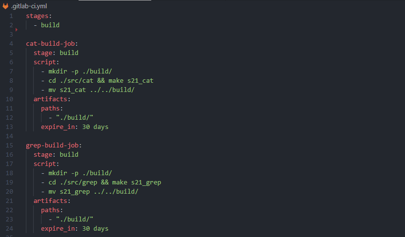

# Basic CI/CD (Report)

## Contents

1. [Настройка gitlab-runner](#part-1-настройка-gitlab-runner)  
2. [Сборка](#part-2-сборка)  
3. [Тест кодстайла](#part-3-тест-кодстайла)   
4. [Интеграционные тесты](#part-4-интеграционные-тесты)  
5. [Этап деплоя](#part-5-этап-деплоя)  
6. [Дополнительно. Уведомления](#part-6-дополнительно-уведомления)

### Part 1. Настройка **gitlab-runner**

* Поднимем виртуальную машину *Ubuntu Server 22.04 LTS*.

    

* Для удобства сделаем подключение по ssh (wsl -> ubuntu):

    * Устанавливаем *openssh-server* на ubuntu командой `sudo apt-get install openssh-server`

    * Проверяем статус работы:

        
    
    * Настраиваем правила проброса портов для работы wsl с ubuntu

        * Для этого:

        1) Узнаем ip-адрес wsl командой `ip a`: **172.30.254.156**

        2) Узнаем ip-адрес хоста (Windows) командой `ipconfig`: **192.168.56.1**

        3) Записываем правила для проброса портов

        

    * Подключаемся к Ubuntu Server через wsl командой: `ssh -p 2222 login@ipaddress`

        * login - **jodyvole**

        * ipaddress - **192.168.56.1** (ip-адрес хоста на windows)

    > Так как напрямую WSL не видит виртуальную машину, то мы подключаемся через промежуточную хост машину на Windows, которая видит и WSL, и виртуальную машину с Ubuntu Server
    
    > Так же можно было работать из командной строки Windows, подключившись к виртуальной машине командой: `ssh -p 2222 jodyvole@127.0.0.1`

##### Скачиваем и устанавливаем на виртуальную машину **gitlab-runner**.
* Скачиваем бинарный файл с gitlab-runner, используя команду

    `sudo curl -L --output /usr/local/bin/gitlab-runner "https://s3.dualstack.us-east-1.amazonaws.com/gitlab-runner-downloads/latest/binaries/gitlab-runner-linux-amd64"`

* Даем права на исполнение

    `sudo chmod +x /usr/local/bin/gitlab-runner`

* Создаем нового пользователя

    `sudo useradd --comment 'GitLab Runner' --create-home gitlab-runner --shell /bin/bash`

* Устанавливаем как службу

    `sudo gitlab-runner install --user=gitlab-runner --working-directory=/home/gitlab-runner`

    

##### Запускаем **gitlab-runner** и регистрируем его для использования в текущем проекте (*DO6_CICD*).

* Запускаем ранера командой `sudo gitlab-runner start`

* Регистрируем ранера с помощью токена:

    1) Выполним команду регистрации: `sudo gitlab-runner register`

    2) Вводим URL-адрес нашего Gitlab'а: *https://repos.21-school.ru*

    3) Вводим токен футентификации ранера: *GR1348941p2EKaj3cCmQiMXHNjU19*

    4) Добавляем описание для ранера

    5) Вводим тип ранера

    

### Part 2. Сборка

* Напишем тестовый **.gitlab-ci.yml** файл

    

* Запушим изменения на удаленный репозиторий

    

* Чтобы устранить эту ошибку закомментируем скрипт в файле `/home/gitlab-runner/.bash_logout` на виртуальной машине

    

* Проверяем

    

#### Напишем этап для **CI** по сборке приложений из проекта *SimpleBashUtils*.

* Редактируем файл **.gitlab-ci.yml**

    

    >Запуск сборки осуществляется через мейк файл из проекта SimpleBash

    >Файлы, полученные после сборки (артефакты), сохраняются в папку *build* проекта со сроком хранения 30 дней

* Результат:

    

### Part 3. Тест кодстайла

#### Напишем этап для **CI**, который запускает скрипт кодстайла (*clang-format*).

* Результат:

    

* Вывод *codestyle-check-job*:

    

### Part 4. Интеграционные тесты

#### Напишем этап для **CI**, который запускает интеграционные тесты из того же проекта.

##### Этот этап запускается автоматически только при условии, если сборка и тест кодстайла прошли успешно.

##### Если тесты не прошли, то пайплайн "фейлится".

##### Вывод пайплайна при успешном прохождении тестов

* Пайплайн:

    

* Вывод в пайплайне:

    

### Part 5. Этап деплоя

* Поднимаем вторую виртуальную машину *Ubuntu Server 22.04 LTS* (копируется первая машина с генерацией новых MAC-адресов)

* Создаем локальную сеть для двух машин

    * Для этого на обеих машинах включаем 2-ой сетевой адаптер с внутренней сетью *itnet*

    * Настраиваем на каждой машине файл конфигураций *50-cloud-init.yaml*

    * Пингуем машины, чтобы удостовериться, что все работает исправно

        

#### Напишем этап для **CD**, который «разворачивает» проект на другой виртуальной машине.

>Этот этап запускается вручную при условии, что все предыдущие этапы прошли успешно

* Для копирования файлов на другую машину с помощью *gitlab-runner'а* нужно предарительно выполнить несколько шагов:

    * Для машины с *gitlab-runner'ом*:

    1) Переключаемся на пользователя *gitlab-runner* командой `sudo su - gitlab-runner`

    2) Генерируем ключи *ssh* командой `ssh-keygen`

    3) Копируем ключ на вторую машину командой `ssh-copy-id username@remote_host`, где
        - username: **jodyvole**
        - remote_host: **10.20.0.20**

    4) Подключаемся ко второй машине командой `ssh username@remote_host`
    >

    5) Добавляем ключ хоста в known_hosts, используя команду `ssh-keyscan -H 10.20.0.20 >> /home/gitlab-runner/.ssh/known_hosts`
        >Эта команда нужна для того, чтобы *gitlab-runner* мог подтвердить, что он действительно подключается к тому серверу, которого ожидает

    * Теперь мы можем использовать ключ для аутентификации на второй машине

##### Напишем bash-скрипт, который при помощи **ssh** и **scp** копирует файлы, полученные после сборки (артефакты), в директорию */usr/local/bin* второй виртуальной машины.

> Также необходмо дать нужные права доступа диретории, куда будут копироваться файлы на второй машине

* Результат:

    

    

* Проверка работы:

    

##### В случае ошибки пайплайн «фейлится».

### Part 6. Дополнительно. Уведомления

##### Настрим уведомления об успешном/неуспешном выполнении пайплайна через бота с именем «[мой nickname] DO6 CI/CD» в *Telegram*.

* Создадим файл с секретными данными в `/home/gitlab-runner/` директории и с названием **secret_info.conf** в машине с runner'ом:

    

* Напишем скрипт для отправки сообщений ботом:

    

* Отредактируем *.gitlab-ci.yml* файл:

    

* Сообщения отправленные ботом в Telegram^

    